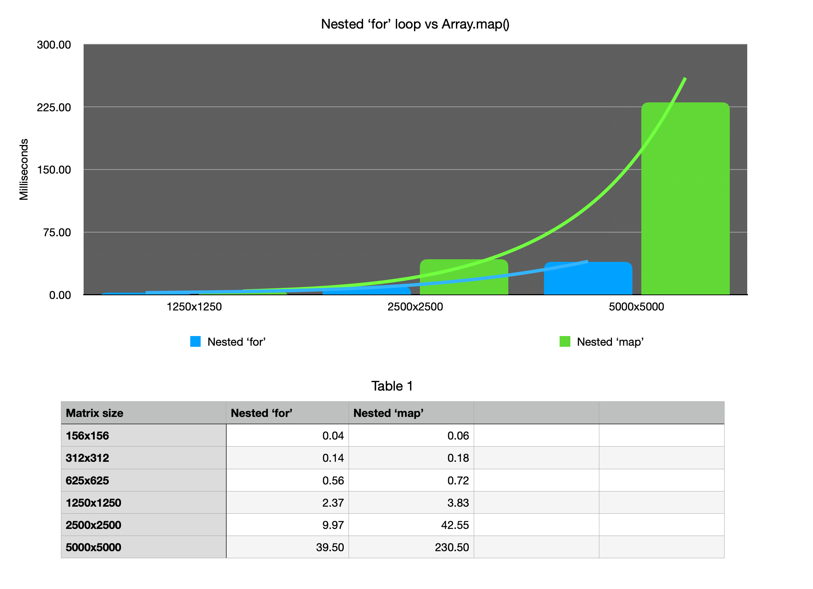

# Nested operations: which is better?
## <b>Background

Nested operations are expensive.  To make matters worse, they can be hard to read for a variety of reasons.  This repo serves as a platform to manually compare common looping constructs against built-in Javascript Methods.

## <b>Methodology
* Generate a 2D-array of size 'n x n'. 
* Pass in the array along with test to be performed and number of total trials to run to a trials function.  
* Display the computed average run time for trials.

## <b>Current tests
* Nested 'for' loops vs. nested Array.prototype.map()

## <b>Results
